Essentials of Mathematics, and Statistics Coursework
================
Amy Duguid

# Part 1: Simulate Markov Chains

\##Introduction In this first exercise, we will look at a simple model
for a hypothetical disease where there are two stages of sickness, the
first where the sickness can be managed at home, and the second where
the patient needs to be hospitalized. This is represented by the
following Markov Chain. You will go through creating simulations based
on this Markov Chain.

Here is the Markov Chain for the disease, where the states are Healthy
(H), Sick at home (S_0), Sick in the hospital (S_H), and the Dead state
(D). The main model we will apply has the following transition
probabilities: 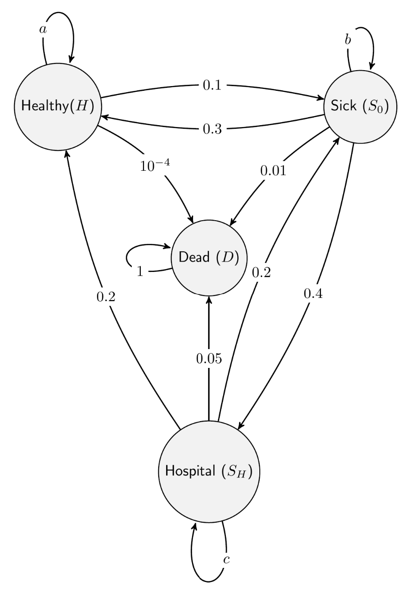

## Question 1

Examine the following piece of code which simulates from a simplified
version of the Markov Chain. This simplified version only has three
states. Also, work out the values for a and b in the code below. 

``` r
set.seed(42) #set seed for reproducible results
n_days <- 700 #set the number of days to 700

#calculate missing transition probabilities
a <- 1 - 0.1 - 0.0001 #calculate a based off given Markov Chain
b <- 1 - 0.3 - 0.01 #calculate b based off given Markov Chain

#create matrix of Markov Chain Model transition probabilities
#state [1] = Healthy(H), state [2] = Sick(S), state [3] = Dead(D)
transition_matrix <- matrix(c(a, 0.1, 0.0001, #from Healthy
                              0.3, b, 0.01, #from Sick
                              0, 0, 1), nrow=3, ncol=3, byrow=TRUE) #from Dead

state <- 1 #on day 0 the patient is in state [1] (Healthy)
patient_record <- rep(0, n_days) #vector to store the simulated values

#create for loop to simulate patient condition over 700 days
for (day in 1:n_days) { #simulate for 700 days
  pr <- transition_matrix[state, ] #select the row of transition probabilities for the current state

  state <- sample(c(1:3), size = 1, prob = pr) #sample [1],[2] or [3] based on the probabilities in the transition matrix
  patient_record[day] <- state #store the state for each day in patient_record
}

plot(1:n_days, patient_record, "l") #line plot of the stored simulation for each day. 
```

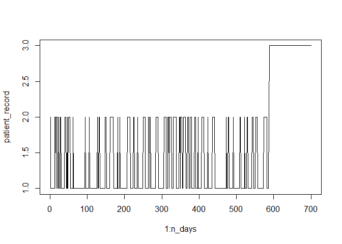<!-- -->

- The above line plot shows the simulation for a single patient over 700
  days based on the three-state Markov Chain Model.
- The predicted state immediately changes from \[0\] to \[2\], which
  means the patient gets sick on the first day.
- After nearly 600 days, the predicted state changes from \[2\] to
  \[3\], which means the patient dies.
- Markov chain predicts the patient will move between healthy and sick
  for almost 600 days, then die.

## Question 2

Extend the Markov Chain to include the state S_H (Sick in the hospital)
and the transition probabilities between the states. Also, work out the
values for a, b, and c in the code below. We define state 1 as H, state
2 as S_0, state 3 as S_H, and state 4 as D. Use the transition
probabilities from the four-state Markov Chain above. Plot the states
for a simulation for a single patient.

``` r
set.seed(42) #set seed for reproducible results
n_days <- 700 #set the number of days to 700

#calculate missing probabilities based off given Markov chain
a <- 1 - 0.1 - 0.0001 - 0
b <- 1 - 0.3 - 0.01 - 0.4
c <- 1 - 0.2 - 0.2 - 0.05

#create transition matrix with new state added
#state [1] = Healthy (H), state [2] = Sick at Home(S0), state [3] = Sick in Hospital(SH), state [4] = Dead(D)
transition_matrix <- matrix(c(a, 0.1, 0, 0.0001, #from Healthy
                              0.3, b, 0.4, 0.01, #from Sick at Home
                              0.2, 0.2, c, 0.05, #from Sick in Hospital
                              0, 0, 0, 1), nrow=4, ncol=4, byrow=TRUE) #from Dead

state <- 1 #on day 0 the patient is in state [1] (Healthy)
patient_record <- rep(0, n_days) #vector to store the patient's state on each day

#create for loop to simulate patient condition over 700 days
for (day in 1:n_days) { #simulate for 700 days
  pr <- transition_matrix[state, ] #select the row of transition probabilities for the current state

  state <- sample(c(1:4), size = 1, prob = pr) #sample to move between states based on the transition matrix
  
  patient_record[day] <- state #store the state for each day in patient_record
}

#plot #line plot of the stored simulation for each day
plot(1:n_days, patient_record, "l", main = "State Simulation Over 700 Days For One Patient")
```

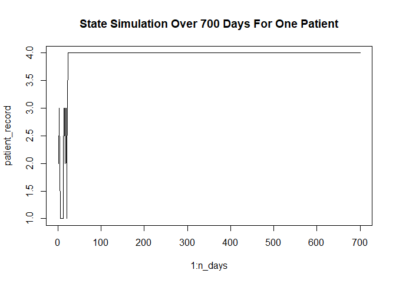<!-- -->

- The above line plot shows the simulation for a single patient over 700
  days based on the four-state Markov Chain Model.
- The patient shifts between states \[1\]-(H), \[2\]-(S0) and \[3\]-(SH)
  for about 25 days until moving to state \[4\]-(Dead).
- Compared to the three-state model, when new state SH is introduced,
  the patient is predicted to die sooner.
- This is because the new state SH has a higher probablity of
  transitioning directly to Dead state (0.05) compared to states
  H(0.001) and S0(0.01).

## Question 3

Repeat the simulation for the four-state Markov Chain above for 1000
patients, by extending your code from the previous question or
otherwise. Choose an appropriate plot to display how long a patient
spends in each state, on average. Also, calculate the average time spent
in each state for the 1000 patients. Explain the results and what the
selected plot shows.

### Code Extended for 1000 Patients

``` r
set.seed(42) #set seed for reproducible results
n_days <- 700 #set the number of days to 700

#calculate missing probabilities based off given Markov chain
a <- 1 - 0.1 - 0.0001 - 0
b <- 1 - 0.3 - 0.01 - 0.4
c <- 1 - 0.2 - 0.2 - 0.05

#Four-state transition matrix
#state [1] = Healthy (H), state [2] = Sick(S0), state [3] = Sick in Hospital(SH), state [4] = Dead(D)
transition_matrix <- matrix(c(a, 0.1, 0, 0.0001, #from Healthy
                              0.3, b, 0.4, 0.01, #from Sick at Home
                              0.2, 0.2, c, 0.05, #from Sick in Hospital
                              0, 0, 0, 1), nrow=4, ncol=4, byrow=TRUE) #from Dead

n_patients <- 1000 #number of patients to loop through
State <- matrix(NA, nrow = n_patients, ncol = n_days) #create a matrix to store the state for each day for each patient

#create for loop to extend code for 1000 patients
for (patient in 1:n_patients) { #loop through each patient
  
  state <- 1 #reset the state back to [1] (Healthy) for day 0 for each patient
  
  for (day in 1:n_days) { #simulate for 700 days
    pr <- transition_matrix[state, ] #select the row of transition probabilities for the current state

    state <- sample(c(1:4), size = 1, prob = pr) #sample to move between states based on the transition matrix
    
    State[patient,day] <- state #for every patient, store the state for each day in State matrix
                                #each row is a patient and each column is a day
  }
}
```

### Visualising How Long a Patient Spends in Each State on Average

``` r
#average time a patient spends in each state = frequency of each state for all patients divided by number of patients
total_time <- table(State) #table of frequency of each state from the matrix
average_time <- total_time / n_patients #divide by total number of patients for the average

knitr::kable(average_time, caption = "Average Days in Each State For 1000 Patients")
```

| State |    Freq |
|:------|--------:|
| 1     |  95.749 |
| 2     |  18.154 |
| 3     |  16.299 |
| 4     | 569.798 |

Average Days in Each State For 1000 Patients

``` r
average_time_df <- as.data.frame(average_time) #convert to a dataframe

#create barplot of how long a patient spends in each state, on average
ggplot(data = average_time_df, aes(x = State, y = Freq, fill = State))+
  geom_bar(stat = "identity")+
  labs(x = "State",
       y = "Average Time Spent in State (days)",
       title = "Barplot of How Much Time a Patient Spends in Each State on Average")+
  scale_fill_brewer(palette = "Pastel1")+
  theme_classic()+
  theme(legend.position = "none")
```

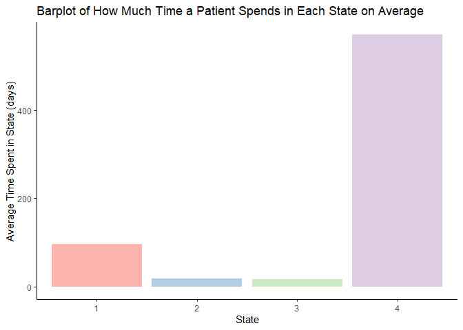<!-- -->

- The above barplot shows that on average a patient spends most time out
  of the 700 days in state 4 (dead).
- This is because once the patient is in state 4 they can’t transition
  back to the other states.
- The second highest amount of time on average is in state 1 (healthy).
- This is because if the patient is healthy, there is a higher
  probability of staying healthy than moving to other states (0.899).

## Question 4

Q: Comment if you expect to see a difference in the simulation if the
starting state is changed to S_0, S_H, or D. Explain your reasoning.

A: Yes, you would expect to see a difference in the simulation if the
starting state was changed to S0, SH, or D. This is because the
transition matrix has different probabilities for each of the states
moving to a different state. For example, if you start in D, the patient
will remain in this state the entire time because the probability of
moving to another state is 0. As the patient becomes increasingly sick
and moves from H to S0 to SH, the probability of the patient immediately
moving to D state increases from 0.001 to 0.01 to 0.05. If starting at
S0, the patient also has a higher chance of moving to SH(0.4) than
moving back to H(0.3). Therefore, I would expect the patient to reach D
state in a shorter time if the model starts on S0 or SH than if the
model starts on H. However, if the first state change results in H
again, the simulation is more likely to end up looking similar.

# Part 2: Data Analysis

## Question 5

For this part of the coursework you will need the data file
(assess_data_1224.Rdata), instructions to download the file can be found
on the course canvas page. This file contains the following objects:

Y: gene expression matrix with 4,568 genes (along the rows) and 30
samples (along the columns) from 15 tumour-normal tissue pairs.
patient_data: data.frame with metadata for each patient. You will
perform the analysis in two steps, first you will look at the data to
identify visually any problems with the data followed by a differential
expression analysis to identify genes that are differentially expressed
between tumour and normal tissue using regression.

``` r
#load required packages
library(tidyverse) #load tidyverse package for formatting, manipulating and visualising data
library(MASS) #load mass package for statistical functions

#load data
load("C:/Users/amydu/OneDrive/Documents/Maths_and_stats_coursework/assess_data_1224.Rdata")

idx <- 20 #assign idx to integer 20
c_cl <- 15:30 #assign c_cl to a vector of integers from 15 to 30

#plot boxplot showing the distribution of log-transformed gene counts
boxplot(log2(Y[, c_cl] + 1))
```

<!-- -->

``` r
#x axis is samples 15 to 30. Sample 15 is tumour tissue but 16-30 are normal tissue. 
#Gene count data is normalised with log transformation and +1 is added to handle zeroes. 
#boxplot shows the median is consistent across samples, but there are many outliers.

#create tmp dataframe to use for glm function
x <- patient_data$tissue[c_cl] #selecting tissue column from metadata dataframe for samples 15-30
z <- patient_data$patient[c_cl] #selecting patient column from metadata dataframe for samples 15-30
tmp <- data.frame(y = Y[idx, c_cl], x = x, z = z, lib_size = colSums(Y[, c_cl])) 
#data frame contains count data and metadata for the 20th gene(ENSG00000168014) across samples 15-30.
#metadata includes tissue type, patient ID and library size.
#library size is the total number of reads for each sample.

#fit a generalised linear model from tmp data
out <- glm(y ~ x + z + lib_size, data = tmp, family = "poisson") 
#predictor variables are x(tissue type), z(patient ID) and lib_size(total reads)
#response variable is y(gene expression of ENSG00000168014)
#response variable is assumed to follow a Poisson distribution

#extract the P value from the above model
p_val <- summary(out)$coefficients[2, 4]
```

## Question 6 - Quality Control

There is one problematic sample in the data, identify the problematic
sample and explain why it is problematic. Provide evidence and/or a plot
to support your answer. You could consider using some statistics on the
data to identify the problematic sample or any other suitable approach.

``` r
#find Problematic Sample
#PCA to check for any outliers
normalised_data <- log2(Y + 1) #normalise data for comparability
pca <- prcomp(t(normalised_data), scale. = TRUE) #run PCA on scaled data
```

``` r
#visualise the PCA results
pca_result <- as.data.frame(pca$x) #get the coordinates of samples (scores)
pca_result$Sample <- rownames(pca_result) #add labels to identify samples

ggplot(pca_result, aes(x = PC1, y = PC2, label = Sample)) + #plot PC1 against PC2
  geom_point(size = 3) +
  geom_text(vjust = -0.5, size = 3) + #add sample labels
  labs(title = "PCA Plot of Normalised Count Data", x = "PC1", y = "PC2") +
  theme_minimal()
```

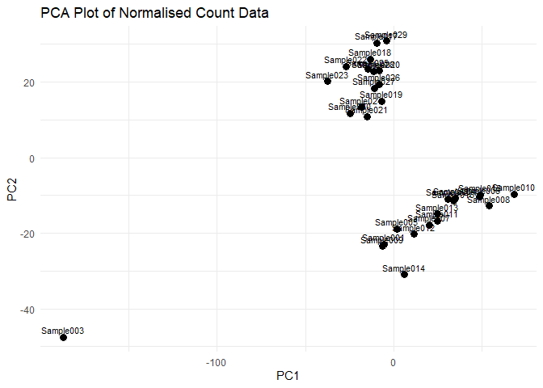<!-- -->

- The PCA shows two clear clusters (Normal and Tumour) and one sample
  outlier.
- The outlier is labelled as Sample003.

``` r
#Further comparison to double check if Sample003 is truly the outlier:
boxplot(normalised_data,
  main = "Distribution of Normalised Counts for Each Sample",
  xlab = "Sample",
  ylab = "Normalised Counts (log2 Counts)")
```

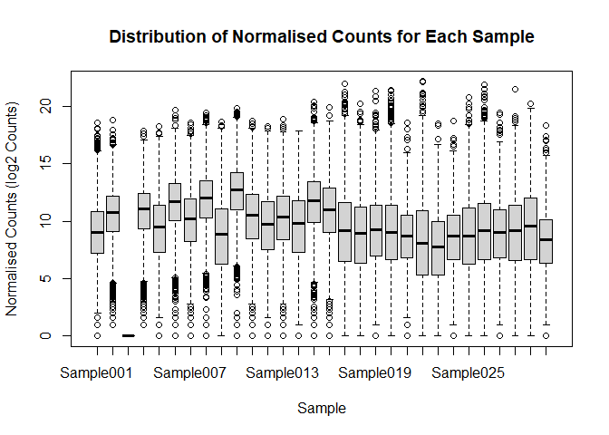<!-- -->

- Sample003 has a different distribution of normalised counts compared
  to the other samples.
- The counts for Sample003 are all zero, showing this is the problematic
  sample.
- Zero values could be because of technical issues during sequencing or
  poor sequencing depth (Zyla et al., 2023).

``` r
library(dplyr)
#Remove sample003 from the expression matrix
qc_data <- Y[, colnames(Y) != "Sample003"]

#remove sample003 from patient data
patient_data <- patient_data %>% filter(sample_id != "Sample003")
```

## Question 7 - Differential Expression with a Single Covariate

Using the code from Q5, perform a regression-based differential
expression analysis between all normal and tumour samples using Poisson
regression. Use the tissue type as the only covariate. Plot the
appropriate log10 p-value from your analysis.

``` r
#count number of rows in matrix to loop through each gene
gene_list <- nrow(qc_data)

#initialise variable to store p-values
p_values <-rep(0,gene_list)
estimate <- rep(0,gene_list)

#create a function to apply the linear model for each gene
for (i in 1:gene_list) { #loop through all the genes 
  
  y <- qc_data[i,] #for each gene take the counts for all samples
  
  x <- patient_data$tissue #filter the tissue type for each sample
  
  expression_df <- data.frame(y = y, x = x) #data frame containing counts and tissue type
  
  de_fit <- glm(y ~ x, data = expression_df, family = "poisson") #GLM using poisson regression
  #gene expression counts are the response variable and tissue type is the predictor variable
  
  estimate[i] <- summary(de_fit)$coefficients[2,1] #store estimate for each gene
  p_values [i] <- summary(de_fit)$coefficients[2,4] #store the p-value associated with the z-statistic for each gene
}
```

``` r
#overview of results
summary(de_fit)
```

    ## 
    ## Call:
    ## glm(formula = y ~ x, family = "poisson", data = expression_df)
    ## 
    ## Coefficients:
    ##              Estimate Std. Error z value Pr(>|z|)    
    ## (Intercept) 10.266340   0.001523 6741.69   <2e-16 ***
    ## xTumour     -0.155641   0.002285  -68.11   <2e-16 ***
    ## ---
    ## Signif. codes:  0 '***' 0.001 '**' 0.01 '*' 0.05 '.' 0.1 ' ' 1
    ## 
    ## (Dispersion parameter for poisson family taken to be 1)
    ## 
    ##     Null deviance: 985640  on 28  degrees of freedom
    ## Residual deviance: 980979  on 27  degrees of freedom
    ## AIC: 981292
    ## 
    ## Number of Fisher Scoring iterations: 6

``` r
head(p_values)
```

    ## [1] 0.0000000 0.0000000 0.0000000 0.0000000 0.7440308 0.0000000

``` r
#adjust P-values to control for false positives
adj_p_vals <- p.adjust(p_values, "bonferroni")

#create a dataframe with the estimate and adjusted p-value associated with each gene
p_val_df <- data.frame(p_values = adj_p_vals, estimate = estimate, idx = 1:gene_list)

#add a small constant for each gene with 0 p-value
p_val_df$p_values[p_val_df$p_values == 0] <- 1e-300

#make column for signficance. NS = not significant
p_val_df$Expression <- "NS"

#upregulated genes with estimate >1 and adjusted p value < 0.05
p_val_df$Expression[p_val_df$p_values < 0.001 & p_val_df$estimate > 1] <- "Upregulated" 

#downregulated genes with estimate <-1 and adjusted p value < 0.05
p_val_df$Expression[p_val_df$p_values < 0.001 & p_val_df$estimate < -1] <- "Downregulated"

#plot -Log10 of the P-value associated with the gene
ggplot(p_val_df, aes(x = idx, y = -log10(p_values), color = Expression)) + 
    geom_point(size = 1.5) +
    labs(
      y = "-log10(adjusted p-value)",
      title = "Manhattan Plot")
```

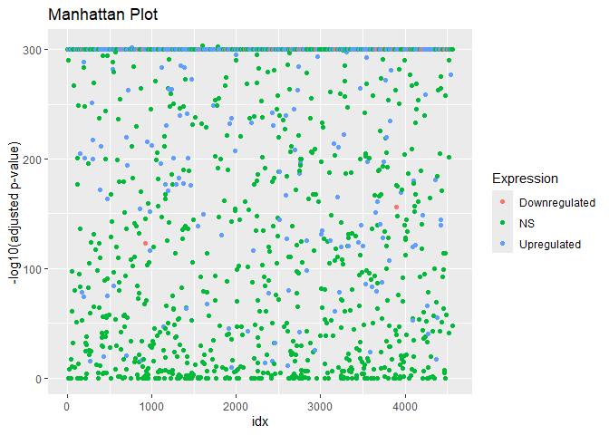<!-- -->

- Above Manhattan plot shows significantly upregulated and downregulated
  genes plotted against their -log10 P value.

- Upregulated genes have estimate \>1 and P value \< 0.001.
  Downregulated genes have estimate \<-1 and P value \< 0.001.

- Genes higher on the y-axis have a smaller adjusted P value so are
  considered more significant.

- There are a lot of genes which have a p value of zero or very small P
  values.

- P values of zero will convert to -log10 p values of infinity.

- I added a small constance (1e-300) to P_values == 0 to for
  visualisation in the Manhattan plot.

- The data is assumed to follow a Poisson distribution (lambda = n\*p),
  where n is the total number of reads(counts), and p is the probability
  of a read mapping to a specific gene.

- Poisson regression assumes the variance and mean are equal, and does
  not handle overdispersed data well(Love et al., 2014).

- The data is overdispersed so the Poisson model has overfitted the
  data.

- For this reason, it is difficult to draw any meaningful conclusions
  from these results.

- I could fix this problem by using a different distribution model
  (negative binomial), which is similar to poisson but includes a
  parameter to estimate the dispersion of data. I will do this for
  question 8.

### Visualising Data Overdispersion

``` r
#calculate mean and variance of each gene
mean_counts <- rowMeans(qc_data)
var_counts <- apply(qc_data, 1, var)

#calculate dispersion across all genes
dispersion <- summary(var_counts / mean_counts)
dispersion
```

    ##      Min.   1st Qu.    Median      Mean   3rd Qu.      Max. 
    ##       3.2    1293.5    3845.7   19440.1   11343.6 2717460.2

The data is clearly very overdispersed because the ratio of variance to
mean is much greater than one across all the genes (OpenAI, 2024b).

``` r
#plot mean vs variance to visualise dispersion
ggplot(qc_data, aes(x = mean_counts, y = var_counts)) +
  geom_point() +
  scale_x_log10() + #log mean
  scale_y_log10() + #log variance
  geom_abline(intercept = 0, slope = 1, col = "red") + #poisson distribution line
  geom_smooth(method = "loess", col = "orange") + #negative binomial distribution line
  ggtitle("Mean vs Variance Plot")
```

    ## `geom_smooth()` using formula = 'y ~ x'

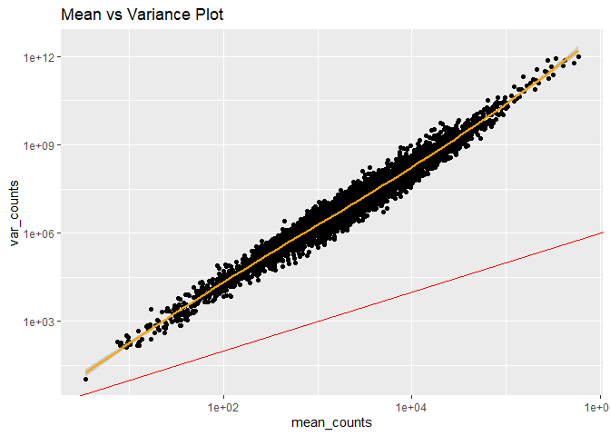<!-- -->

- The above plot shows the relationship between mean and variance for
  the count data.
- The red line represents the Poisson distribution (y=x). The data does
  not follow this line which shows it is not a good fit for Poisson
  distribution
- The data is a good fit for the orange line which shows the variance as
  a quadratic function of the mean.
- This shows the data is a good fit for the Negative Binomial
  generalised linear model (Love et al., 2014).

## Question 8 - Differential Expression Analysis with Covariates Using DESEQ2

Perform a regression-based analysis to identify genes differentially
expressed between normal and tumour samples including the tissue
variable indicating if it is tumour or normal sample. Plot the
appropriate log 10p-value from your analysis.Compare the p-values with
and without inclusion of the tissue type as a covariate, what do you
observe? Which of the covariate has the biggest effect? Explain your
answer with supporting plots, tables and further analysis if required.

Here, I have investigated the null hypothesis that there is no
significant difference in gene expression based on tissue type (normal
or tumour).

I decided to use DESEQ2 package for this question because it has a
function to normalise the data by library size, and uses negative
binomial linear regression, which accounts for data overdispersion
(McCarthy et al., 2012).

How Deseq2 works: (1) Calculates normalisation factors for each sample
to adjust counts for library depth of each sample. Uses median of ratios
method to calculate normalisation factors. (2) Models the dispersion
parameter to estimate variability across samples using maximum
likelihood estimate. (3) Fits negative binomial linear model to estimate
the response variable (expression counts) from the covariates (tissue
type and patient ID).

``` r
if (!requireNamespace("DESeq2", quietly = TRUE)) {
    if (!requireNamespace("BiocManager", quietly = TRUE))
        install.packages("BiocManager")
    BiocManager::install("DESeq2")
}
```

``` r
library(DESeq2)

#convert data for input to Deseq
storage.mode(qc_data) <-"integer" #integer count data
patient_data$tissue <- as.factor(patient_data$tissue) #categorical variable
patient_data$patient_id <- as.factor(patient_data$patient_id) #categorical variable 

#create dds object for input to deseq
dds <- DESeqDataSetFromMatrix(
    countData = qc_data, #count data
    colData = patient_data, #metadata
    design = ~ tissue + patient_id) #design matrix - full model with two covariates (tissue and patientID)
#Library size is not included as a covariate because DESEQ2 normalises data using library size
#there is no information about the experiment so I assumed library size is not a covariate

#run deseq
dds_full <- DESeq(dds, fitType  = "local")
#Assumes negative binomial distribution
#fittype = "local" uses local regression to calculate the dispersion parameter (not parametric).
```

``` r
#create deseq results object comaparing genes differentially expressed between tissue type using the Wald test
result_full <- results(dds_full, contrast = c("tissue", "Tumour", "Normal")) 

#add a column for significance based on thresholds:
result_full$Expression <- "NS"  # NS = Non-significant
result_full$Expression[result_full$padj < 0.001 & result_full$log2FoldChange > 4] <- "Upregulated" #upregulated genes
result_full$Expression[result_full$padj < 0.001 & result_full$log2FoldChange < -4] <- "Downregulated" #downregulated genes

#dataframe of upregulated genes
upregulated <- result_full %>%
  data.frame() %>% #convert results table to dataframe
  arrange(desc(log2FoldChange)) %>% #sort by log2FoldChange in descending order
  filter(Expression == "Upregulated") #select only the upregulated genes 

#top upregulated genes
head(upregulated)
```

    ##                   baseMean log2FoldChange     lfcSE      stat       pvalue         padj  Expression
    ## ENSG00000137185   649.4224       6.234822 0.6969398  8.945998 3.686038e-19 7.164493e-17 Upregulated
    ## ENSG00000198700  5062.0320       6.209687 0.7868499  7.891831 2.977845e-15 1.374020e-13 Upregulated
    ## ENSG00000070269   511.2284       6.186351 0.5877508 10.525465 6.593541e-26 1.003977e-22 Upregulated
    ## ENSG00000106261 14238.9964       6.154604 0.8746215  7.036877 1.965957e-12 4.677340e-11 Upregulated
    ## ENSG00000257727  3238.5172       6.149401 0.7296505  8.427872 3.520079e-17 3.349942e-15 Upregulated
    ## ENSG00000101126 29911.3804       6.026806 0.8127582  7.415251 1.213946e-13 3.960932e-12 Upregulated

``` r
#dataframe of downregulated genes
downregulated <- result_full %>%
  data.frame() %>% #convert results table to dataframe
  arrange(log2FoldChange) %>% #sort by log2FoldChange in descending order
  filter(Expression == "Downregulated") #select only the upregulated genes 

#top downregulated genes
head(downregulated)
```

    ##                  baseMean log2FoldChange     lfcSE       stat       pvalue         padj    Expression
    ## ENSG00000104884 116430.41     -13.099096 0.6430600 -20.369942 3.090418e-92 1.411703e-88 Downregulated
    ## ENSG00000173273 505893.73      -9.605905 0.9200332 -10.440824 1.614027e-25 1.843219e-22 Downregulated
    ## ENSG00000205302  29685.25      -9.586812 0.7697744 -12.454054 1.329178e-35 3.035843e-32 Downregulated
    ## ENSG00000102007  83379.65      -9.155539 1.0773747  -8.498008 1.928724e-17 1.957869e-15 Downregulated
    ## ENSG00000132522 153905.18      -9.024632 0.8837626 -10.211602 1.759357e-24 1.148106e-21 Downregulated
    ## ENSG00000146676 338544.55      -8.273788 0.9067429  -9.124734 7.191257e-20 1.642483e-17 Downregulated

``` r
#number of upregulated genes
up_genes <- nrow(upregulated)
#number of downregulated genes
down_genes <- nrow(downregulated)

#table of number of upregulated/downregulated genes
siggenes_no <- data.frame(upregulated_genes = up_genes, downregulated_genes = down_genes)
rownames(siggenes_no) <- "number of differentially expressed genes"
kable(siggenes_no)
```

|  | upregulated_genes | downregulated_genes |
|:---|---:|---:|
| number of differentially expressed genes | 112 | 181 |

- From this result, there are 112 upregulated genes and 181
  downregulated genes, with log2 fold change greater than abs(0.4), and
  adjusted p-value smaller than 0.001.
- Log Fold Change shows the effect size of the covariate on this
  particular gene. The higher log fold change, the higher the magnitude
  of differential expression between tissue types.
- Wald Test Statistic is the statistic from the Wald Test (Log Fold
  Change / Log Fold Change Standard Error).
- Adjusted P-value shows the P value associated with the Wald test
  statistic, adjusted for multiple testing.
- Smaller Adjusted P values show stronger evidence against the null
  Hypothesis that there is no significant difference in expression based
  on tissue type (Piper, 2017b).
- Log-fold change of greater than abs(0.4) means these genes are 4x
  differentially expressed between tissue type groups.
- Adjusted p-value smaller than 0.001 means the probability this
  differential expression occured under the null hypothesis is 0.1%.
- I set a strict threshold for upregulated and downregulated genes for
  visualisation.

``` r
library(ggplot2)

#plot log2FC against -log10(adjusted p value)
ggplot(result_full, aes(x = log2FoldChange, y = -log10(padj), color = Expression)) +
    geom_vline(xintercept = c(-4,4), col = "gray", linetype = "dashed")+ #log2FC threshold
    geom_hline(yintercept = c(-log10(0.001)), col = "gray", linetype = "dashed")+ #P-value threshold
    scale_color_manual(values = c("Upregulated" = "red", "Downregulated" = "blue", "NS" = "gray"))+ #colour upregulated/downregulated
    geom_point(alpha = 0.6, size=1) +
    theme_minimal() +
    labs(title = "Volcano Plot", x = "Log2 Fold Change", y = "-Log10 Adjusted P-value")
```

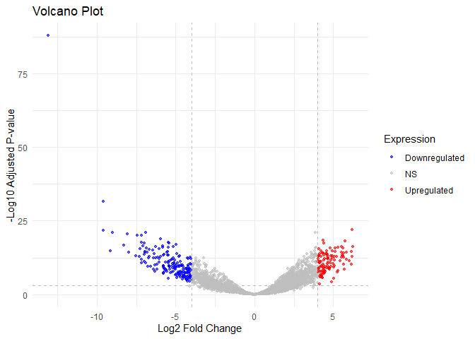<!-- -->

- This is a volcano plot displaying the results from the differential
  expression analysis.
- Each dot is a gene.
- Upregulated genes are highlighted red.
- Downregulated genes are highlighted blue.
- Dotted lines show thresholds for upregulated and downregulated genes.

``` r
library(dplyr)

#create categories for heatmap
patient_data_reduced <- data.frame(patient_data[,-c(2,3)])
rownames(patient_data_reduced) <- colnames(qc_data) #set rownames to sample names
colnames(patient_data_reduced) <- "tissue" #metadata with only tissue type column

#data for heatmap
dds <- estimateSizeFactors(dds)
vst_counts <- vst(dds, blind = TRUE) #variance stabilising transformation for visualisation with clustering
normalised_counts <- assay(vst_counts) #extract counts from stabilised data
upregulated_names <- rownames(upregulated)
upregulated_counts <- normalised_counts[upregulated_names,] #select upregulated genes from normalised counts
downregulated_names <- rownames(downregulated)
downregulated_counts <- normalised_counts[downregulated_names,] #select downregulated genes from normalised counts
```

``` r
if (!requireNamespace("pheatmap", quietly = TRUE)) {
  install.packages("pheatmap")
}
library(pheatmap)
```

``` r
#heatmap of upregulated genes
pheatmap(upregulated_counts ,
         cluster_rows = FALSE, #don't cluster based on genes
         cluster_cols = TRUE, #clustering based on columns (sample ID)
         show_rownames = FALSE, #don't show gene IDs
         clustering_distance_cols = "euclidean", #cluster by euclidean distance
         main = "Heatmap of Upregulated Differentially Expressed Genes", #title
         annotation_col = patient_data_reduced, #group columns by cancerous or paracancerous
         color = colorRampPalette(c("blue", "white", "red"))(100) #change colour scheme
)
```

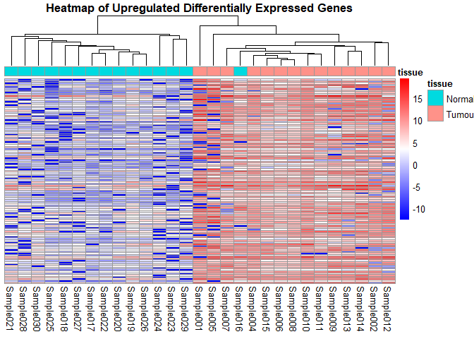<!-- -->

- Above heatmap shows upregulated genes and which samples are tumour or
  normal (OpenAI, 2024a).
- Rows are genes and columns are samples.
- Colour corresponds to logFC in expression.
- These are genes upregulated in tumour tissue samples and downregulated
  in normal tissue samples.
- Samples have a key to label them as tumour tissue or normal tissue.
- Samples have clustered clearly into tumour and normal tissue based on
  differential expression.

``` r
#heatmap of downregulated genes
pheatmap(downregulated_counts,
         cluster_rows = FALSE, #don't cluster based on genes
         cluster_cols = TRUE, #clustering based on columns (sample ID)
         show_rownames = FALSE, #don't show gene IDs
         clustering_distance_cols = "euclidean", #cluster by euclidean distance
         main = "Heatmap of Downregulated Differentially Expressed Genes", #title
         annotation_col = patient_data_reduced, #group columns by cancerous or paracancerous
         color = colorRampPalette(c("blue", "white", "red"))(100) #change colour scheme)
)
```

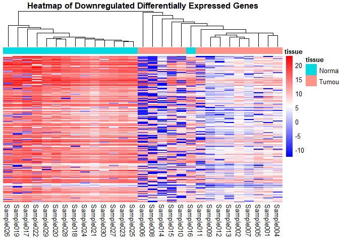<!-- -->

- Above heatmap shows downregulated genes and which samples are tumour
  or normal (OpenAI, 2024a).
- Rows are genes and columns are samples.
- Colour corresponds to logFC in expression.
- These are genes upregulated in normal tissue samples and downregulated
  in tumour tissue samples.
- Samples have a key to label them as tumour tissue or normal tissue.
- Samples have clustered clearly into tumour and normal tissue based on
  differential expression.

### Reduced Model without Tissue Type Covariate

``` r
dds_reduced <- DESeqDataSetFromMatrix(
    countData = qc_data,
    colData = patient_data,
    design = ~ patient_id) #reduced model with only patient ID in the design matrix

dds_reduced <- DESeq(dds_reduced, fitType  = "local")
```

``` r
#create column for upregulated and downregulated genes in the reduced model
result_reduced <- results(dds_reduced)
result_reduced$Expression <- "NS"  # NS = Non-significant
result_reduced$Expression[result_reduced$padj < 0.001 & result_reduced$log2FoldChange > 4] <- "Upregulated"#upregulated
result_reduced$Expression[result_reduced$padj < 0.001 & result_reduced$log2FoldChange < -4] <- "Downregulated"#downregulated

#create dataframes including upregulated and downregulated genes for reduced model
upregulated_reduced <- result_reduced %>%
  data.frame() %>%
  arrange(desc(log2FoldChange)) %>% #sort by log2FoldChange in descending order
  filter(Expression == "Upregulated") #select only the upregulated genes 
#top upregulated genes from reduced model
head(upregulated_reduced)
```

    ##                   baseMean log2FoldChange    lfcSE     stat       pvalue         padj  Expression
    ## ENSG00000140365   307.0404       21.59298 2.741559 7.876168 3.375735e-15 5.140119e-12 Upregulated
    ## ENSG00000167904  1318.8353       21.33536 2.501955 8.527475 1.495764e-17 3.416325e-14 Upregulated
    ## ENSG00000188603   431.0219       18.17259 2.771756 6.556345 5.514252e-11 5.037821e-08 Upregulated
    ## ENSG00000189266 26051.9396       14.42771 2.476868 5.824983 5.711832e-09 3.727378e-06 Upregulated
    ## ENSG00000132842  4039.8778       13.96749 1.931040 7.233144 4.719370e-13 5.389520e-10 Upregulated
    ## ENSG00000076685  5396.7466       12.86854 2.335324 5.510385 3.580494e-08 1.635569e-05 Upregulated

``` r
downregulated_reduced <- result_reduced %>%
  data.frame() %>%
  arrange(log2FoldChange) %>% #sort by log2FoldChange in descending order
  filter(Expression == "Downregulated") #select only downregulated genes
#top downregulated genes from reduced model
head(downregulated_reduced)
```

    ##                   baseMean log2FoldChange    lfcSE       stat       pvalue         padj    Expression
    ## ENSG00000114520   913.0470     -25.369002 2.510414 -10.105506 5.222512e-24 2.385644e-20 Downregulated
    ## ENSG00000104442  1028.5911     -12.543823 2.698741  -4.648027 3.351252e-06 7.654259e-04 Downregulated
    ## ENSG00000101126 29911.3804     -12.265913 2.689513  -4.560645 5.099666e-06 9.795702e-04 Downregulated
    ## ENSG00000177830   324.6687     -11.186776 2.212576  -5.055996 4.281500e-07 1.222368e-04 Downregulated
    ## ENSG00000196712  8433.7469     -10.118169 1.910504  -5.296073 1.183197e-07 4.504037e-05 Downregulated
    ## ENSG00000138613   215.1188      -9.870535 2.164814  -4.559530 5.126823e-06 9.795702e-04 Downregulated

``` r
#plot log2FC against -log10(adjusted p value) for reduced model
ggplot(result_reduced, aes(x = log2FoldChange, y = -log10(padj), color = Expression)) +
    geom_vline(xintercept = c(-4,4), col = "gray", linetype = "dashed")+
    geom_hline(yintercept = c(-log10(0.001)), col = "gray", linetype = "dashed")+
    scale_color_manual(values = c("Upregulated" = "red", "Downregulated" = "blue", "NS" = "gray"))+
    geom_point(alpha = 0.6, size=1) +
    theme_minimal() +
    labs(title = "Volcano Plot", x = "Log2 Fold Change", y = "-Log10 Adjusted P-value")
```

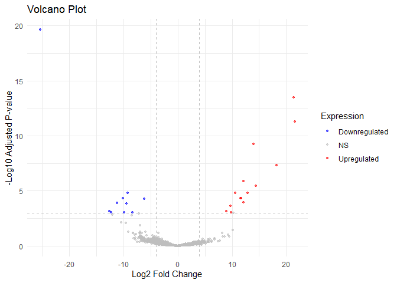<!-- -->

- Reduced model has 15 upregulated genes and 14 downregulated genes.
- Reduced model shows a lot less genes upregulated/downregulated
  compared to the full model.
- Visually we can see P values are much larger in the reduced model.

``` r
sum(result_reduced$padj)
```

    ## [1] 3701.81

``` r
sum(result_full$padj)
```

    ## [1] 898.7467

``` r
#Sum of the P values is much lower for the full model than the reduced model.
#This suggests the covariate tissue type has a more significant impact on the response variable.
```

``` r
#adjusted p values for top 10 upregulated genes in full model
upregulated_pvals <- upregulated %>% dplyr::select(padj) %>% format(scientific = TRUE) %>% slice_head(n = 10) 
knitr::kable(upregulated_pvals, caption = "Table of Adjusted P Values for Upregulated Genes in Full Model")
```

|                 | padj         |
|:----------------|:-------------|
| ENSG00000137185 | 7.164493e-17 |
| ENSG00000198700 | 1.374020e-13 |
| ENSG00000070269 | 1.003977e-22 |
| ENSG00000106261 | 4.677340e-11 |
| ENSG00000257727 | 3.349942e-15 |
| ENSG00000101126 | 3.960932e-12 |
| ENSG00000163867 | 1.421692e-12 |
| ENSG00000182986 | 5.218914e-15 |
| ENSG00000106400 | 8.320692e-19 |
| ENSG00000137776 | 2.419106e-09 |

Table of Adjusted P Values for Upregulated Genes in Full Model

``` r
#adjusted p values for top 10 upregulated genes in reduced model
upregulated_reduced_pvals <- upregulated_reduced %>% dplyr::select(padj) %>% format(scientific = TRUE) %>% slice_head(n = 10) 
knitr::kable(upregulated_reduced_pvals, caption = "Table of Adjusted P Values for Upregulated Genes in Reduced Model")
```

|                 | padj         |
|:----------------|:-------------|
| ENSG00000140365 | 5.140119e-12 |
| ENSG00000167904 | 3.416325e-14 |
| ENSG00000188603 | 5.037821e-08 |
| ENSG00000189266 | 3.727378e-06 |
| ENSG00000132842 | 5.389520e-10 |
| ENSG00000076685 | 1.635569e-05 |
| ENSG00000077514 | 1.149998e-04 |
| ENSG00000138078 | 1.295766e-06 |
| ENSG00000135540 | 4.504037e-05 |
| ENSG00000040199 | 4.519978e-05 |

Table of Adjusted P Values for Upregulated Genes in Reduced Model

Adjusted p values for upregulated genes are smaller for full model,
suggesting the full model provides a better prediction of the response
variable than the reduced model.

``` r
#adjusted p values for top 10 downregulated genes in full model
downregulated_pvals <- downregulated %>% dplyr::select(padj) %>% format(scientific = TRUE) %>% slice_head(n = 10) 
knitr::kable(downregulated_pvals, caption = "Table of Adjusted P Values for Downregulated Genes in Full Model")
```

|                 | padj         |
|:----------------|:-------------|
| ENSG00000104884 | 1.411703e-88 |
| ENSG00000173273 | 1.843219e-22 |
| ENSG00000205302 | 3.035843e-32 |
| ENSG00000102007 | 1.957869e-15 |
| ENSG00000132522 | 1.148106e-21 |
| ENSG00000146676 | 1.642483e-17 |
| ENSG00000095380 | 2.711858e-21 |
| ENSG00000144233 | 3.962197e-15 |
| ENSG00000175215 | 8.723383e-14 |
| ENSG00000174953 | 8.740511e-21 |

Table of Adjusted P Values for Downregulated Genes in Full Model

``` r
#adjusted p values for top downregulated genes in reduced model
downregulated_reduced_pvals <- downregulated_reduced %>% dplyr::select(padj) %>% format(scientific = TRUE) %>% slice_head(n = 10) 
knitr::kable(downregulated_reduced_pvals, caption = "Table of Adjusted P Values for Downregulated Genes in Reduced Model")
```

|                 | padj         |
|:----------------|:-------------|
| ENSG00000114520 | 2.385644e-20 |
| ENSG00000104442 | 7.654259e-04 |
| ENSG00000101126 | 9.795702e-04 |
| ENSG00000177830 | 1.222368e-04 |
| ENSG00000196712 | 4.504037e-05 |
| ENSG00000138613 | 9.795702e-04 |
| ENSG00000102710 | 1.473863e-04 |
| ENSG00000014216 | 1.518235e-05 |
| ENSG00000132824 | 9.795702e-04 |
| ENSG00000110060 | 5.371960e-05 |

Table of Adjusted P Values for Downregulated Genes in Reduced Model

Adjusted p values for downregulated genes are smaller for full model,
suggesting the full model provides a better prediction of the response
variable than the reduced model.

### Likelihood Ratio Test to Compare Covariates

- Likelihood ratio test (LRT) compares how well the full model,
  including the covariates tissue and patient ID, fits the data compared
  to the reduced model with a single covariate.

- LRT computes the log-likelihood of the data for the full and reduced
  model, then calculates the test statistic from the ratio of these
  values.

- LRT Stat = 2x (Log likelihood of full model - log likelihood of
  reduced model).

- Since the sample size is large (29 samples), the LRT statistic is
  assumed to follow a Chi-squared distribution.

- The P-value associated with each gene is calculated by comparing the
  LRT statistic to the Chi-squared distribution with degrees of freedom
  equal to the difference in the number of free parameters between the
  full and reduced models.

- The P value is then adjusted to control for false positives.

- I have computed LRT for two reduced models containing only tissue type
  and patient ID, then compared the number of genes with significant
  adjusted P-values for both reduced models to determine which covariate
  has the biggest effect.

- The null hypothesis for this test is that the covariate not included
  in the reduced model does not have any significant effect on gene
  expression.

- Rejecting the null hypothesis means there is a significant amount of
  variation in gene expression caused by the covariate not included in
  the reduced model.

- I have considered adjusted P-values of below 0.001 as significant,
  meaning the likelihood of observing this LRT statistic under the null
  hypothesis is 0.1%.

- If a gene has an adjusted P value below 0.001, the null hypothesis is
  rejected for this gene.

``` r
#LRT for reduced model with only patient ID included, following Chi-squared distribution with 1 degree of freedom
LRT <- DESeq(dds, test = "LRT", reduced=~patient_id, fitType = "local")
LRT_result_patient <- results(LRT)
```

``` r
#LRT for reduced model with only tissue type included, following Chi-squared distribution with 14 degrees of freedom 
LRT <- DESeq(dds, test = "LRT", reduced=~tissue, fitType = "local")
LRT_result_tissue <- results(LRT)
```

``` r
#create a dataframe for LRT results of reduced model with only patientID covariate
LRT_siggenes_tissue <- LRT_result_patient %>%
                data.frame() %>% #convert to dataframe
                filter(padj < 0.001) #filter for significant genes

#number of significant genes due to effect of tissue type
siggenes_tissue <- nrow(LRT_siggenes_tissue)

#create a dataframe for LRT results of reduced model with only tissue type covariate 
LRT_siggenes_patient <- LRT_result_tissue %>% 
                data.frame() %>% #filter for significant genes
                filter(padj < 0.001) #filter for significant genes

#number of significant genes due to effect of patient ID
siggenes_patient <- nrow(LRT_siggenes_patient)

#table of significantly different genes between models
siggenes_df <- data.frame(tissue_effect = siggenes_tissue, patient_id_effect = siggenes_patient)
rownames(siggenes_df) <- "number of significantly different genes"
kable(siggenes_df)
```

|                                         | tissue_effect | patient_id_effect |
|:----------------------------------------|--------------:|------------------:|
| number of significantly different genes |           895 |                51 |

- The LRT shows that out of the two covariates, tissue type has the
  biggest effect on gene expression.
- This is because there is a larger number of genes with counts
  significantly affected by this covariate (Padj \< 0.001).

## Question 9 - Interpretation

Explain the results from the differential expression analysis. What do
you observe from the p-values and the effect sizes? What is the effect
of including the tissue type as a covariate? What is the effect of the
library size on the analysis? You don’t need to perform any further
analysis.

- From the differential expression analysis using DESEQ, there is a
  large number of differentially expressed genes between the two tissue
  types when using the full model (tissue type and patient ID as
  covariates).
- I set a strict threshold for significance (log2FC \> abs(0.4) and adjP
  \< 0.001) because of the large number of genes with small adjusted
  P-values and high log-fold changes.
- This strict threshold helps to reduce false positives with
  differentially expressed genes. However, the threshold could be
  adjusted depending on the aim of the analysis.
- Including tissue type as a covariate signficantly improves the model
  estimates and increases the number of significantly differentially
  expressed genes detected.
- Likelihood Ratio Test determines tissue type has the biggest effect
  out of the two covariates.
- Since different genes have different library sizes, it is important to
  normalise the data for library size before performing a regression
  model fit.
- This is because genes with larger library sizes have larger counts on
  average due to the larger number of reads overall, which introduces
  bias. Without normalisation based on library size it is impossible to
  compare counts between samples.
- DeSeq uses median of ratios method to normalise counts based on
  library size (Piper, 2017a).

# Reference List

<div id="refs" class="references csl-bib-body">

<div id="ref-love_moderated_2014" class="csl-entry">

Love, M.I., Huber, W. and Anders, S. (2014) Moderated estimation of fold
change and dispersion for RNA-seq data with DESeq2. *Genome Biology*, 15
(12): 550.
doi:[10.1186/s13059-014-0550-8](https://doi.org/10.1186/s13059-014-0550-8).

</div>

<div id="ref-mccarthy_differential_2012" class="csl-entry">

McCarthy, D.J., Chen, Y. and Smyth, G.K. (2012) Differential expression
analysis of multifactor RNA-Seq experiments with respect to biological
variation. *Nucleic Acids Research*, 40 (10): 4288–4297.
doi:[10.1093/nar/gks042](https://doi.org/10.1093/nar/gks042).

</div>

<div id="ref-openai_chatgpt_2024-1" class="csl-entry">

OpenAI (2024a) *ChatGPT, Response to the prompt "how to transform deseq
normalised counts in r for visualisation with heatmap"*. Available at:
<https://chat.openai.com/.>

</div>

<div id="ref-openai_chatgpt_2024" class="csl-entry">

OpenAI (2024b) *ChatGPT, Response to the prompt "how to visualise
overdispersion of count data in R"*. Available at:
<https://chat.openai.com/.>

</div>

<div id="ref-piper_count_2017" class="csl-entry">

Piper, M., Radhika Khetani (2017a) Count normalization with DESeq2.
*Introduction to DGE - ARCHIVED*. Available at:
<https://hbctraining.github.io/DGE_workshop/lessons/02_DGE_count_normalization.html>
(Accessed: 12 December 2024).

</div>

<div id="ref-piper_gene-level_2017" class="csl-entry">

Piper, M., Radhika Khetani (2017b) Gene-level differential expression
analysis with DESeq2. *Introduction to DGE - ARCHIVED*. Available at:
<https://hbctraining.github.io/DGE_workshop/lessons/05_DGE_DESeq2_analysis2.html>
(Accessed: 12 December 2024).

</div>

<div id="ref-zyla_evaluation_2023" class="csl-entry">

Zyla, J., Papiez, A., Zhao, J., et al. (2023) Evaluation of zero counts
to better understand the discrepancies between bulk and single-cell
RNA-Seq platforms. *Computational and Structural Biotechnology Journal*,
21: 4663–4674.
doi:[10.1016/j.csbj.2023.09.035](https://doi.org/10.1016/j.csbj.2023.09.035).

</div>

</div>
